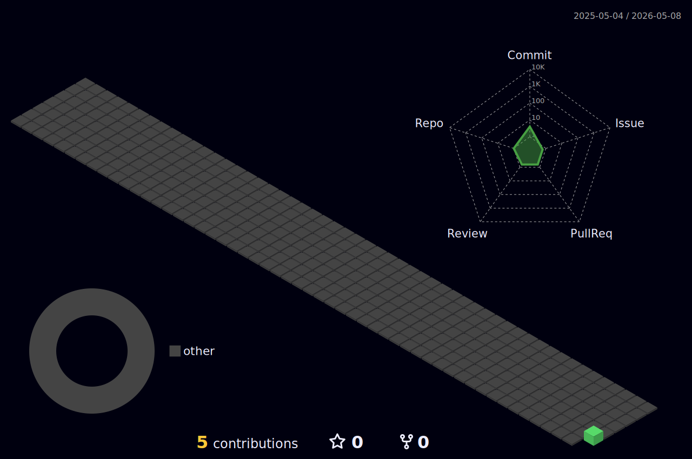

<div align="center">
  
</div>

<br/>

<!-- BOOT SEQUENCE -->
```
╔══════════════════════════════════════════════════════════════════╗
║          CLIMATE INTELLIGENCE SYSTEM — BOOT SEQUENCE            ║
╠══════════════════════════════════════════════════════════════════╣
║  [✓] Identity loaded .............. SHARUN TOMY / Kerala, India  ║
║  [✓] Degree ....................... MSc Data Analytics (Active)   ║
║  [✓] Primary mission .............. GreenLens — LIVE             ║
║  [✓] Satellite link ............... ESA Sentinel-2 — CONNECTED   ║
║  [✓] Bonds scanned ................ 1,345 real green bonds        ║
║  [✓] Greenwashing detected ......... 156 cases flagged           ║
║  [✓] NASA Space Apps 2025 ......... Local 1st Runner-Up 🏆       ║
║  [✓] Publication status ........... Accepted — June 2026         ║
║  [>] Awaiting next mission... _                                   ║
╚══════════════════════════════════════════════════════════════════╝
```

<div align="center">


</div>

---

## 🧑‍💻 About Me

I am a **climate intelligence researcher and data systems developer** from Kerala, India, currently pursuing an **MSc in Data Analytics** at Mahatma Gandhi University. My work sits at the intersection of **Earth observation, machine learning, and sustainable finance**. I build systems that use satellite imagery to verify real-world climate claims, catch greenwashing in green bond markets, and deliver early-warning signals to disaster-vulnerable communities.

My flagship project **GreenLens** is a live, publicly deployed platform that has independently scored **1,345 real green bonds** using ESA Sentinel-2 satellite data and XGBoost risk modelling — without relying on issuer self-disclosure. I am driven by a single belief: **climate accountability should be impossible to fake.**

- 🌍 &nbsp; Based in **Kottayam, Kerala, India**
- 🎓 &nbsp; **MSc Data Analytics** — Mahatma Gandhi University (2024–2027)
- 📄 &nbsp; **Research publication accepted - June 2026**
- 🏆 &nbsp; **NASA Space Apps Challenge 2025** - Local 1st Runner-Up
- 🔭 &nbsp; Currently building **GreenLens** (satellite-verified green finance)
- 📬 &nbsp; Reach me at **sharuntomy5@gmail.com**

---

## 🎓 Education

| Degree | Institution | Period | Score |
|--------|-------------|--------|-------|
| **MSc Data Analytics** | Mahatma Gandhi University, Kottayam | 2024 – 2027 (ongoing) | — |
| **BCA — Bachelor of Computer Applications** | Mahatma Gandhi University, Kottayam | 2021 – 2024 | 6.80 / 10 |
| **Higher Secondary (DHSE)** | Holy Cross Higher Secondary School, Kerala | Completed 2021 | 79.58% |

> 📌 Thesis (BCA): *KISSAN MART — A Web Application for the Agricultural Sector*

---

## 🔬 Research & Publication

<table>
<tr>
<td width="75px" align="center">📄</td>
<td>

**Artificial Intelligence for Carbon Footprint Prediction and Green Finance Optimisation: A Literature Review**
<br/>
*Review Article · Accepted June 2026*
<br/>
This literature review explores how artificial intelligence and data analytics improve carbon footprint prediction and green finance optimisation. Based on fourteen studies from 2016–2024, it focuses on machine learning, satellite monitoring, explainable AI, and AI-driven finance systems. The review identifies major research gaps and proposes a five-layer framework integrating carbon prediction, blockchain accountability, and green finance to support sustainability and net-zero goals.

</td>
</tr>
</table>

---

## 🎯 Research Focus Areas

<div align="center">

| 🛰️ Earth Observation & Remote Sensing | 🌿 Climate Risk & Green Finance | ⛓️ Environmental Accountability |
|:---:|:---:|:---:|
| ESA Sentinel-2 · NASA Earthdata | ESG Scoring · Greenwashing Detection | Blockchain · Digital Verification |
| Google Earth Engine · PostGIS | Green Bond Analysis · SHAP Explainability | Carbon Markets · Transparency Systems |

| 🤖 Applied Machine Learning | 🌐 Geospatial Systems | 🚨 Disaster Intelligence |
|:---:|:---:|:---:|
| XGBoost · PyTorch ResNet-18 | Leaflet.js · PostGIS · GeoJSON | Early Warning Systems |
| Climate Risk Modelling | Interactive Risk Dashboards | NASA Earth Observation Data |

</div>

---

## ⚡ Featured Projects

<table>
<tr>
<td width="50%" valign="top">

### 🛰️ GreenLens
**Satellite-Verified Climate Risk — Green Finance**
`April 2026 · Sole Developer & System Architect`

An independent climate intelligence platform that **verifies real green bonds** using ESA Sentinel-2 imagery, XGBoost physical risk scoring, and live financial market data. No reliance on issuer self-disclosure.

- ✅ Scored **1,345+** real bonds globally
- 🚨 Flagged **156** greenwashing cases
- 📊 SHAP explainability on every score
- 🌐 Publicly deployed web dashboard


`SDGs 13 · 7 · 17`

</td>
<td width="50%" valign="top">

### ⚡ QUASAR
**Climate Prediction & Early Warning System**
`Oct 2025 · Predictive Model & Platform Designer`

Forecasts natural disasters using **NASA open-source Earth observation data** and historical climate patterns. Delivers early alerts to communities with limited disaster-response infrastructure.

- 🌪️ Real-time weather + historical data fusion
- 📡 Accessible digital alert delivery
- 🏆 NASA Space Apps Challenge 2025 — **Local 1st Runner-Up**


`SDGs 13 · 11`

</td>
</tr>
<tr>
<td width="50%" valign="top">

### 🌧️ DROUGHT
**Citizen-Government Environmental Platform**
`Oct 2025 · Co-Creator`

Citizens report pollution (plastic burning, waste dumping, air pollution) via **photo evidence**. Authorities tracked for timely compliance. Digital rewards for verified community reports.

- 📸 Location-based photo evidence reporting
- 🏛️ Government accountability tracking
- 🎁 Digital reward system for verified reports


`SDGs 6 · 13 · 17`

</td>
</tr>
<tr>
<td width="50%" valign="top">

### 📚 STUBE
**Smart Syllabus-Based Digital Learning Platform**
`Jan 2026 · Founder & System Architect`

Verifies student academic identity and provides access only to **syllabus-mapped study materials**, free from entertainment distractions. Content reviewed by educators and high-performing students.


`SDGs 4 · 9 · 10`

</td>
<td width="50%" valign="top">

### 🌾 KISSAN MART
**Agricultural Sector Web Application**
`2024 · BCA Final Thesis`

Full-stack web platform for farmers and agricultural stakeholders — seeds, fertilizers, equipment, expert advice and market insights. Built with **PHP, Django, MySQL**.


`SDGs 2 · 12`

</td>
</tr>
</table>

---

## 🛠 Tech Arsenal

<div align="center">

**Core Languages**

[](https://skillicons.dev)

**AI · Machine Learning · Data Science**

[](https://skillicons.dev)

**Infrastructure · Cloud · DevOps**

[](https://skillicons.dev)

**Climate & Earth Data Stack**


</div>

---

## 📊 GitHub Analytics

<div align="center">


</div>

<div align="center">

[](https://git.io/streak-stats)

</div>

---

## 🌐 Activity Graph

<div align="center">

[](https://github.com/ashutosh00710/github-readme-activity-graph)

</div>

---

## 🗓️ 3D Contribution Calendar

<div align="center">
  
</div>

---

## 🐍 Contribution Trail

<div align="center">
  
</div>

---

## 🏆 Achievements & Recognition

<div align="center">

| 🏆 Award | 📅 Year | 🌍 Scope |
|----------|---------|---------|
| NASA Space Apps Challenge — Local 1st Runner-Up | 2025 | International Competition |
| Research Paper Accepted for Publication | 2026 | Academic |
| ANOMALY — Shortlisted, University Incubation | 2025 | University Level |
| MGU Innovation Big Idea Fest — Participant | 2025 | University Level |

</div>

---

## 🌐 Open Channel

<div align="center">

[](https://sharuntomyportfolio.onrender.com)
[](mailto:sharuntomy7@gmail.com)
[](https://github.com/Sharun7)

</div>

---

<div align="center">
<sub>
🛰️ <code>Sentinel-2</code> · <code>XGBoost</code> · <code>PostGIS</code> · <code>PyTorch ResNet-18</code> · <code>Django</code> · <code>Leaflet.js</code>
<br/>
<i>"Climate accountability should be impossible to fake."</i>
<br/><br/>

</sub>
</div>
